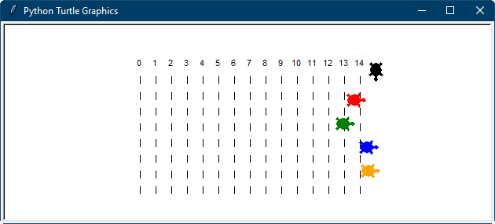

# Turtle Race
Oringinal idea for the project "Turtle Race" comes from [trinket.io - Turtle Race](https://trinket.io/python/9339862606) and it's coded in functional style.
Its source code is in Turtle Race Functional
My OOP version of the same is in Turtle Race OOP

In OOP design we have Race class which inherits just Object base class.
Race instance has list of pilots (competitors) - they are instances of Racer class.
Racer class inherits from my custom class Tortoise (which actually must be abstarct)
And then second implementation of Tortoise is Worker - "rubbish guy", who doesn't even have its name.

Object
	|--> Race
	       ^
	       |
	turtle.Turtle 
		|--> Tortoise 
				|--> Worker
				|--> Racer

